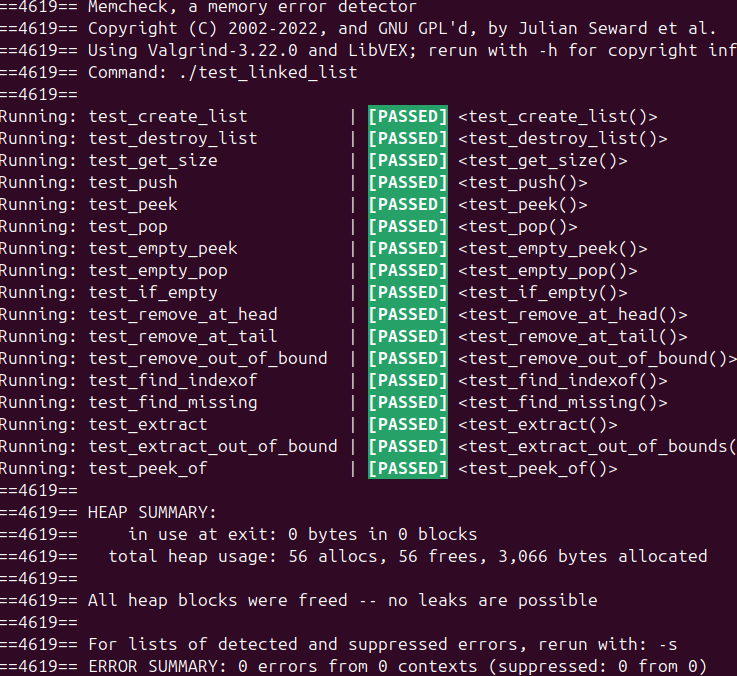

# Collections C

A simple and lightweight implementation of linked list in C, designed with OOP in mind. This library provides basic operations like adding, removing, and searching for elements.


## Table of contents
1 [Installation](#installation)  
2 [API overview](#api-reference)  
  - [2.1 Linked List](#linked-list)
    
3 [Running tests](#running-tests)
## Installation

Clone the repository

```bash
  git clone https://github.com/plutos-pole/c-collections.git
  cd c-collections
```
Compile the library and tests
```bash
make
cd bin
```
    
## API Reference

### Linked List


| Return type| Description             |
| :--------  | :-------------------------: |
| `List *`   | Creates a list |


```c
  List *list = create_list()
```

| Return type| Description             |
| :--------  | :-------------------------: |
| `NULL  `   | Deletes the list and frees all allocated memory  |

```c
  list->destroy(list)
```

| Return type| Description             |
| :--------  | :-------------------------: |
| `size_t`   | Returns the current size of the list  |


```c
  list->size(list)
```

##### Memory must be allocated on the **heap**
| Return type| Arguments | Description |
| :--------  | :-------------------------: |:----|
| `bool`| **ptr** to any type| Assigns **ptr** to the current head |

```c
  list->push(list, ptr)
```


| Return type| Description             |
| :--------  | :-------------------------: |
| `void*`   | Returns a pointer to the current head  |


```c
  list->peek(list)
```

| Return type| Description             |
| :--------  | :-------------------------: |
| `void*`   | Removes and return data from the front of the list. The node is freed.  |

##### The caller is responsible for freeing the returned data
```c
  list->pop(list)
```
| Return type| Description             |
| :--------  | :-------------------------: |
| `void*`   | Returns a pointer to an elemnt at **index** position  |

```c
  list->peek_at(list, index)
```


| Return type| Description             |
| :--------  | :-------------------------: |
| `bool`   | Returns true/false if the list is empty/not  |

```c
  list->is_empty(list)
```


| Return type| Description             |
| :--------  | :-------------------------: |
| `void`   | Removes and frees the node at index  |

```c
  list->remove(list, index)
```
| Return type| Description             |
| :--------  | :-------------------------: |
| `int`   | Returns the index of a query or -1 if it hasn't been found  |

```c
  list->index_of(list, query, callback)
```
```c
  bool callback(void *data, void *query)
```

| Return type| Description             |
| :--------  | :-------------------------: |
| `void*`   | Removes and returns data at the **index** position.|

The caller is responsible for freeing the returned data
```c
  list->extract(list, index)
```

##  Iterator
| Return type| Description             |
| :--------  | :-------------------------: |
| `iterator*`   | Creates and returns iterator  |

```c
  Iterator *iterator = create_list_iterator(list)
```

| Return type| Description             |
| :--------  | :-------------------------: |
| `bool`   | Returns true/false if there's next item in the list  |

```c
  iterator->has_next(list)
```

| Return type| Description             |
| :--------  | :-------------------------: |
| `void*`   | Returns pointer to the next element the list  |

```c
  iterator->next(list)
```


## Running Tests

I wrote a small test library (basically 2 macros). To run the tests, you must run the executables for each data structure individually.

```bash
  cd bin
  ./test*.c
```


## Screenshots


